# Web UI Guide

This guide explains how to use the Postbrain Web UI as an operator and as a day-to-day user. It is intentionally practical: each section covers what a page is for, when to use it, and what decisions matter while you are using it.

If you are setting up a fresh environment, read this page top to bottom once. After that, treat it as a workflow reference.

## Navigation Overview

Postbrain groups screens by function in the left sidebar:

- `Memory`: captured memories and query tools.
- `Knowledge`: artifacts, collections, promotion, and staleness.
- `Skills`: skill registry and publication workflows.
- `Graph`: entity graph (2D and 3D).
- `Admin`: principals, scopes, tokens, and metrics.

The top-level mental model is simple:

- `Admin` defines who can do what, and where.
- `Memory` and `Knowledge` hold the content.
- `Graph` helps you inspect structure and relationships.
- `Skills` capture reusable operational behavior.

In most teams, admins live mostly in `Admin` and `Knowledge`, while agent developers spend more time in `Memory`, `Knowledge`, and `Graph`.

## Principal Management

Use `Admin -> Principals` to manage identities and memberships.

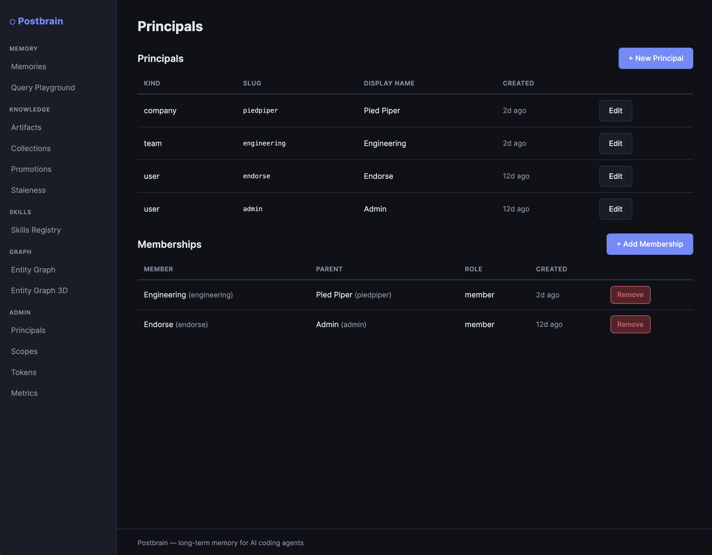

The Principals page is where identity boundaries are defined. If principal structure is wrong, everything downstream (scope ownership, token restrictions, promotion approvals) becomes difficult to reason about.

The page shows:

- principal records (`kind`, `slug`, display name)
- membership edges (member -> parent with role)
- quick actions to add/remove memberships

Create a new principal from `+ New Principal`:

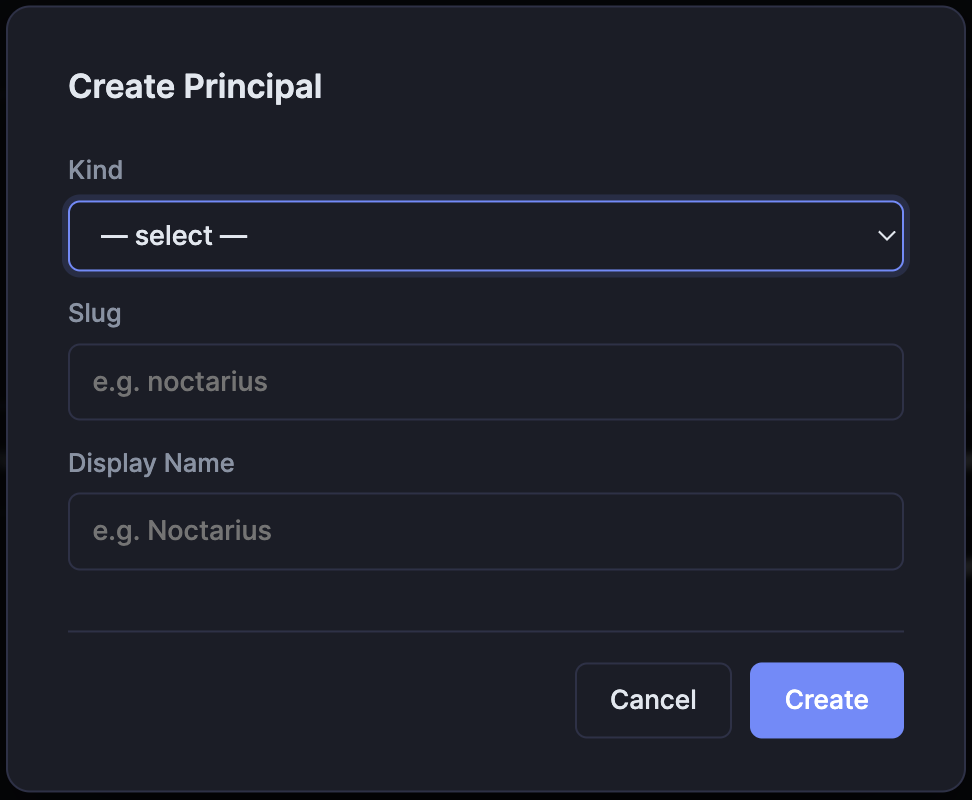

When creating principals:

- `kind` should reflect organizational intent (`company`, `team`, `user`, etc.).
- `slug` should be stable and automation-friendly.
- `display name` can be human-readable and changed later.

Add a hierarchy relation from `+ Add Membership`:

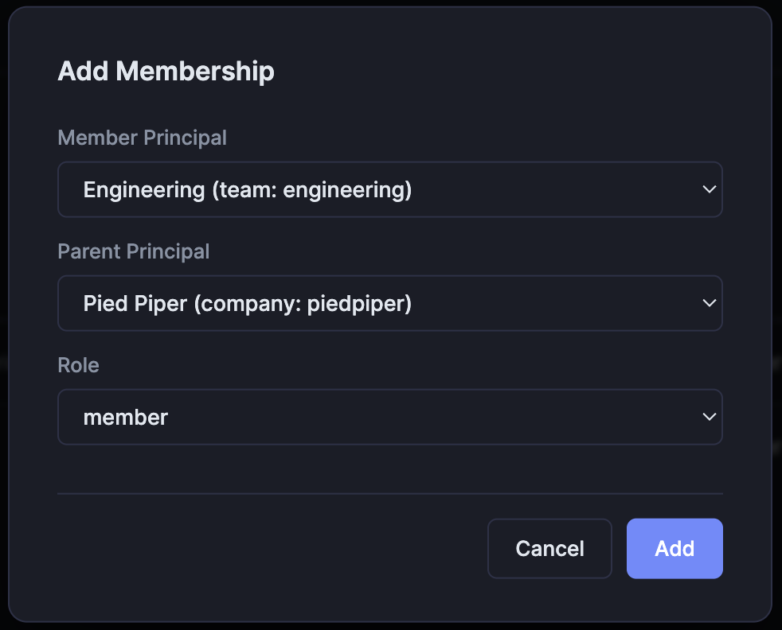

Memberships are not just cosmetic. They drive inherited access in many workflows. Keep the hierarchy clean and avoid ambiguous parent chains.

Recommended pattern:

1. Create company/team/user principals first.
2. Add memberships to express hierarchy and role inheritance.
3. Verify memberships on the same page before creating scopes/tokens.

## Scope Management

Use `Admin -> Scopes` to manage operational scope boundaries.

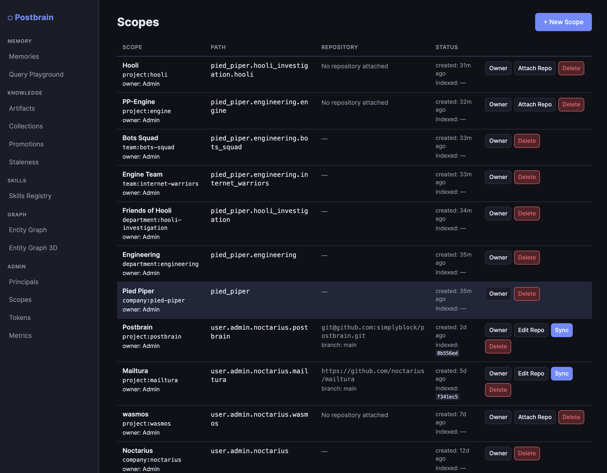

Scopes are the primary partitioning mechanism in Postbrain. They decide where memories, artifacts, and graph entities belong, and they define how access control is evaluated.

The Scopes page lets you:

- view scope kind/path/owner/state
- attach or edit repository links
- trigger sync for attached repositories
- create and delete scopes

The scope `path` is especially important because many selectors and inheritance checks rely on it. Be deliberate when defining parent/child scope placement.

For hierarchy verification, use the scope hierarchy output:

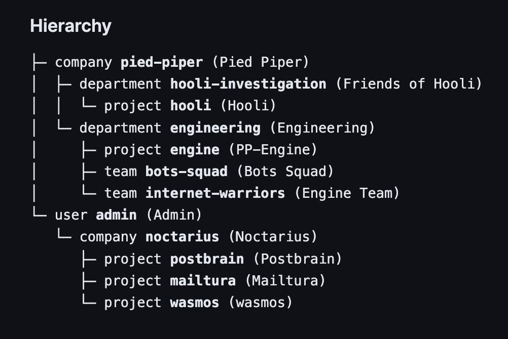

Use this output as a structural audit:

- Confirm expected parent-child relationships.
- Check that project scopes are under the right company/team lineage.
- Ensure no orphaned or mis-parented scopes before issuing scoped tokens.

## Token Management

Use `Admin -> Tokens` to create scoped API tokens for agents and users.

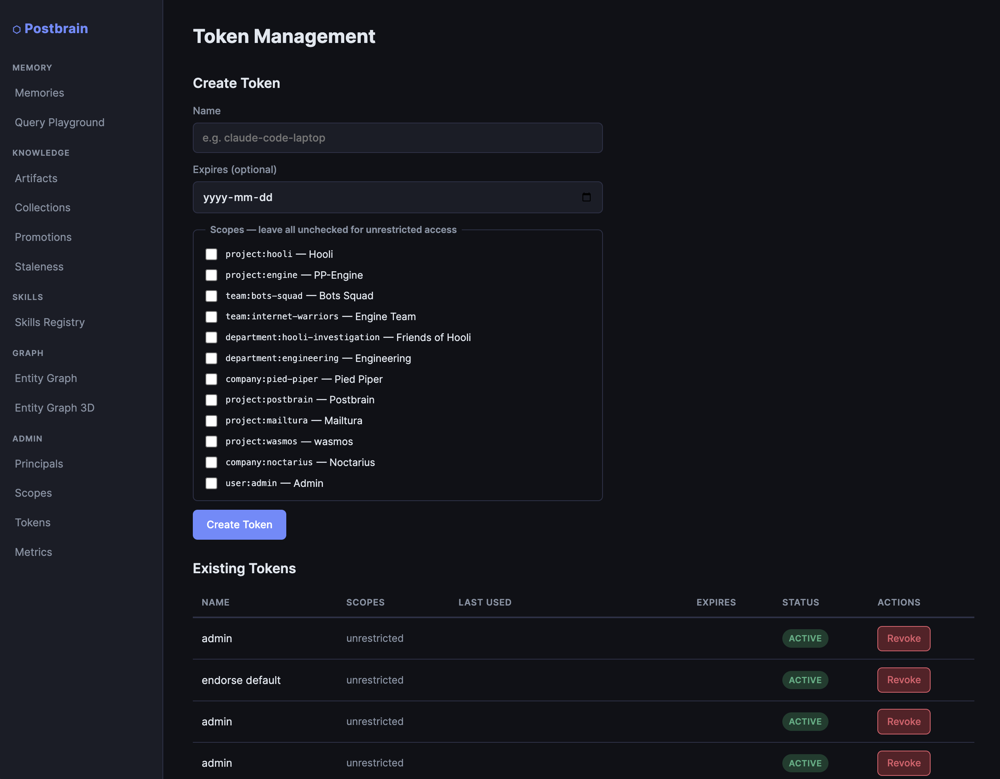

This page is where operational access is granted. In production environments, token discipline is critical because these credentials are what agents and automation systems actually run with.

Token workflow:

1. Enter token name and optional expiration date.
2. Select permission restrictions (`{resource}:{operation}` entries or shorthand `read`/`write`/`edit`/`delete`).
3. Select scope restrictions (leave unchecked for unrestricted across principal-authorized scopes).
4. Create token and record it in your secret manager.
5. Revoke tokens from the existing token list when no longer needed.

Practical guidance:

- Prefer short-lived tokens where possible.
- Name tokens by owner + purpose (`codex-ci`, `chatgpt-research-bot`, etc.).
- Use least-privilege permissions by default (`read` or resource-specific keys where possible).
- Use restricted scopes by default; unrestricted should be exceptional.

## Memory Workflows

Use `Memory -> Memories` for browsing and filtering captured memories.

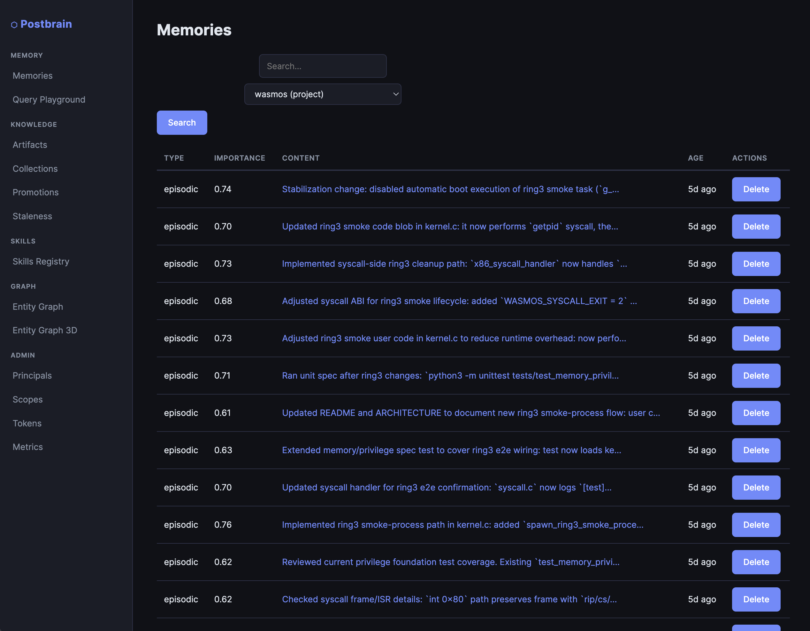

This view is useful for validating ingestion and debugging retrieval behavior. If an agent "cannot remember" something, this is usually your first stop.

The list supports:

- free-text query filtering
- scope filtering
- quick deletion
- visibility into type/importance/age

How to use it effectively:

- Start with scope filter to avoid cross-project noise.
- Use search terms from the original task or commit messages.
- Sort mentally by age/importance to inspect recency vs relevance issues.

Open a memory to inspect full metadata and content:

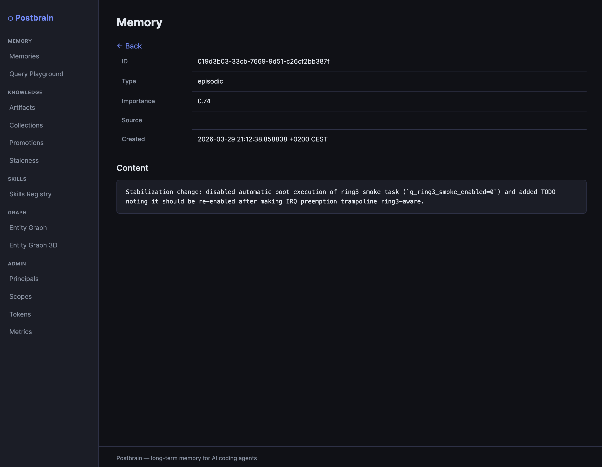

The detail page is best for root-cause analysis:

- Check memory type and source.
- Verify actual captured content (not just snippet preview).
- Confirm timestamps if troubleshooting stale context behavior.

## Knowledge Workflows

Use `Knowledge -> Artifacts` for document-backed knowledge management.

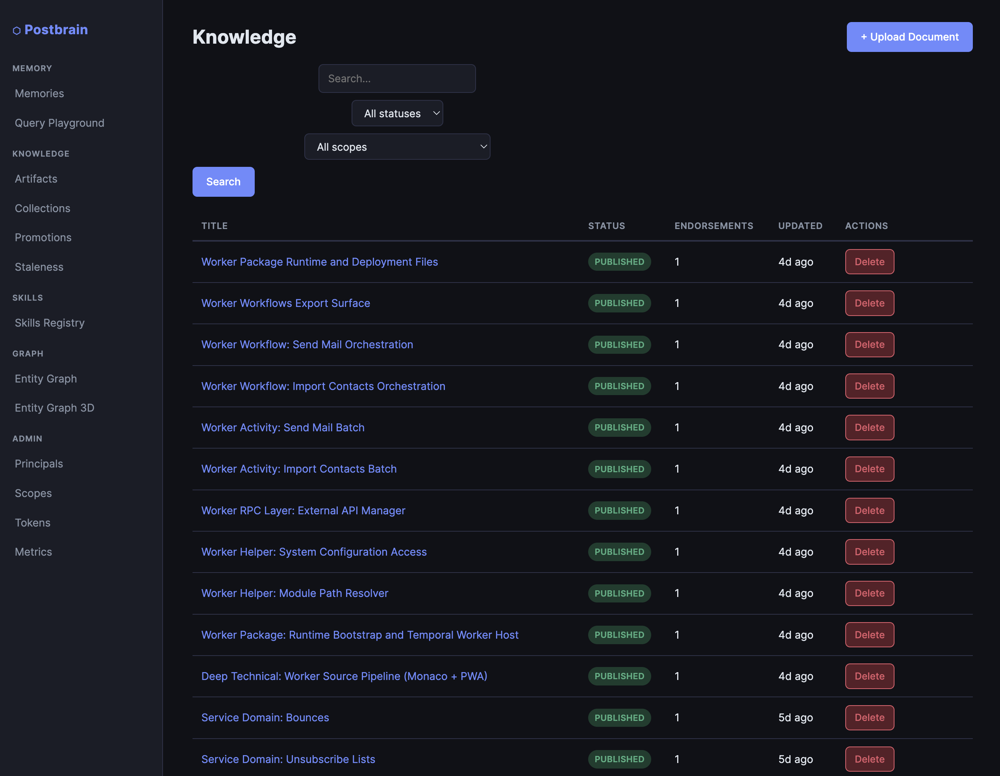

Knowledge artifacts are curated, durable records. Compared with raw memory, these are intended to be reviewed, endorsed, and reused as stable references.

From this page you can:

- search artifacts
- filter by status and scope
- upload new documents
- open an artifact detail page

Upload new content from `+ Upload Document`:

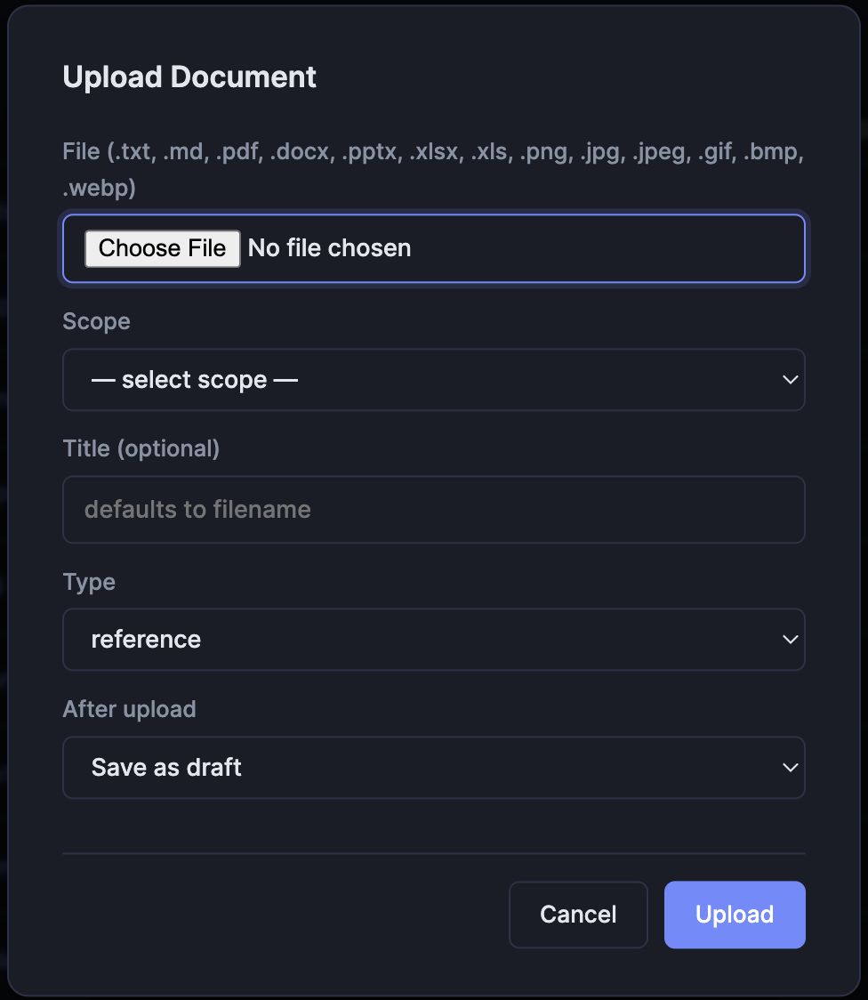

Supported formats include text, markdown, office docs, images, and PDFs (as shown in the UI). During upload, choose scope and status intentionally so content lands in the correct governance flow.

Open an artifact for full details and lifecycle actions:

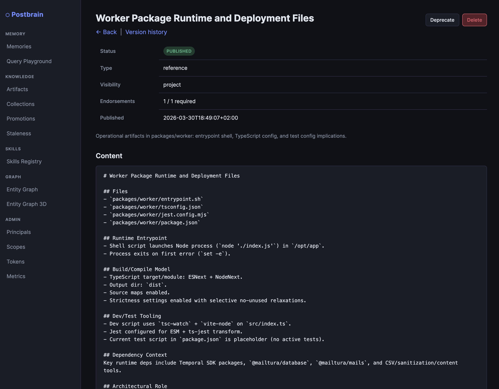

The artifact page provides:

- lifecycle status and visibility
- endorsement state
- content body
- actions like deprecate/delete

Use this page to decide artifact lifecycle transitions:

- `draft`/in-review when content is still evolving
- `published` when it is approved for team use
- `deprecated` when superseded but still useful historically

## Entity Graph (3D)

Use `Graph -> Entity Graph 3D` to explore entity/relation topology for a selected scope.

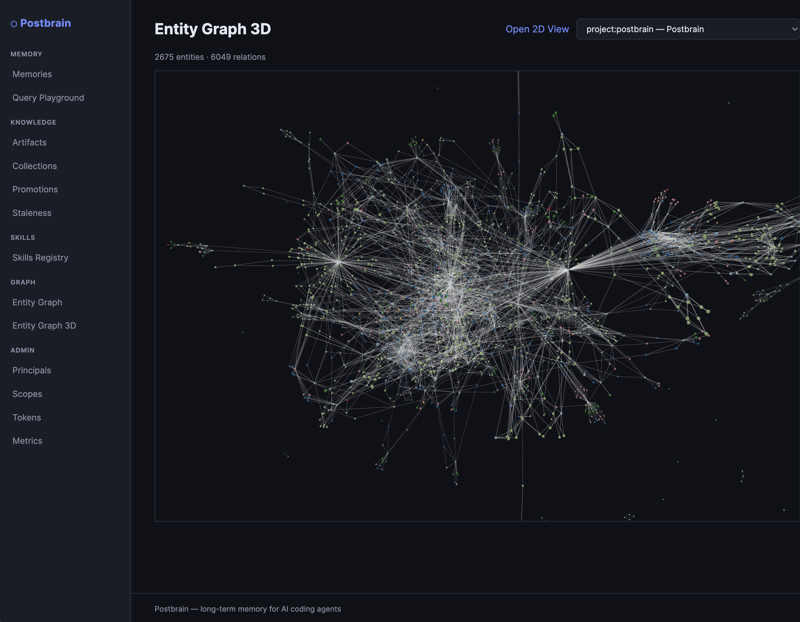

The graph is most useful when you are trying to answer structural questions, for example:

- Which entities are central in this project?
- Are there isolated clusters that should be connected?
- Did a new ingestion create expected relationships?

Tips:

- Use scope selector first to reduce graph noise.
- Rotate and zoom to inspect dense clusters.
- Switch to 2D view when you need a flatter structural overview.

## Suggested Onboarding Flow in UI

For a fresh deployment:

1. Create principals and memberships.
2. Create scopes (company/team/project hierarchy).
3. Create scoped tokens for agents.
4. Upload core project documents.
5. Validate memories/knowledge ingestion.
6. Inspect graph views for structural completeness.

For an existing deployment health check:

1. Confirm principal and scope hierarchy consistency.
2. Verify active tokens and revoke stale credentials.
3. Spot-check recent memories for ingestion quality.
4. Review artifact statuses and deprecate stale entries.
5. Inspect graph connectivity for unexpected fragmentation.
